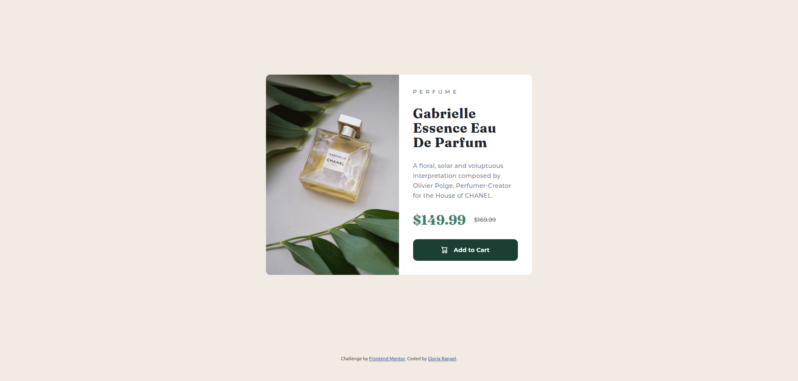

# 🖼 Frontend Mentor - Product preview card component solution

This is a solution to the [Product preview card component challenge on Frontend Mentor](https://www.frontendmentor.io/challenges/product-preview-card-component-GO7UmttRfa). Frontend Mentor challenges help you improve your coding skills by building realistic projects. 

##  📋 Table of contents

-  Overview

-  Screenshot

-  Links

-  My process

-  Built with

-  Useful resources

-  Author

-  Thanks

##  📖 Overview

This is a beginner-friendly challenge focused on building a **responsive product preview card component** using only **HTML & CSS**. The goal is to replicate the provided design as closely as possible while ensuring an optimal layout across different screen sizes.

You are free to use any tools or methodologies to complete this challenge. If there's a technique or framework you want to practice, feel free to incorporate it into your solution.

### Features

- **Responsive Design**: Ensure the layout adapts seamlessly to various screen sizes.
- **Interactive Elements**: Implement hover and focus states for interactive elements.

This challenge is a great way to practice fundamental **HTML & CSS** skills while improving your ability to create responsive components.

###  📸 Screenshot

These are the screenshots of the implemented solution:

-  **🖥️ Desktop version**

- **👆 Hover**  

-  **📱 Mobile version**

###  ⛓️ Links

-  HTML URL: [index.html](https://github.com/NorimNori/product-preview-card-component/blob/main/index.html)

-  CSS URL: [styles.css](https://github.com/NorimNori/product-preview-card-component/blob/main/styles.css)

-  Live Site URL: [on Netlify](https://product-preview-card-component-by-gr.netlify.app/)

##  📌 My process

###  🪚 Built with

-  Semantic HTML5 markup

-  CSS custom properties

-  Flexbox

-  CSS Grid

-  Mobile-first workflow

-  BEM class naming 

-  Google fonts

###  🔬 What I learned

In this project, I reinforced my knowledge of responsive design using only HTML & CSS. Some key takeaways include:

-  **HTML Semantics:** I deepened my understanding of semantic elements, particularly the `<picture>` and `<source>` elements. These allow for more responsive images, serving different image formats or resolutions based on the user's device.

-  **CSS for Responsive Layouts:** I practiced structuring layouts that adapt to different screen sizes, ensuring an optimal user experience.

This project helped me improve my ability to create well-structured, adaptable components while exploring new HTML features for better image optimization.

###  📝 Useful resources

-  [Responsive images](https://web.dev/learn/design/responsive-images?hl=es-419) - This article covers techniques for optimizing images in responsive web design, including using `srcset`, `sizes`, and modern formats to improve performance and adapt images to different screen sizes.

-  [Picture element](https://web.dev/learn/design/picture-element?authuser=2&hl=es-419) - This article explains how to use the `<picture>` element to provide responsive images, allowing you to serve different image sources based on screen size, resolution, or format for better performance and user experience.

##  👋 Author

-  LinkedIn - [Gloria Rangel](https://www.linkedin.com/in/gloria-rangel-06b960306/)

-  Frontend Mentor - [@NorimNori](https://www.frontendmentor.io/profile/NorimNori)

##  🌟 Thank You 🌟

Thanks for visiting this repository! I hope you found it useful and inspiring, or it was just a fun time.

A special thanks to [Frontend Mentor](https://www.frontendmentor.io) for the challenge and for being such an amazing platform to learn and grow as a developer.

Have a nice day! 😊
